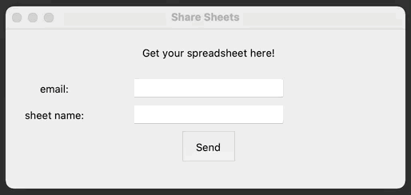

# OpenSheet.exe
OpenSheet is a executable file which creates a Google Spreadsheet with formatted Worksheets. 

This Google Spreadsheet will be shared to the desired google account with the desired name.

# Contents
- OpenSheet.exe - Executable file containing the python script OpenSheet.py
  
- OpenSheet.py - Python script to create and share Google Spreadsheet with formatted Worksheets. 

- deletespreadsheets.py - Python script to delete unwanted Google Spreadsheet, requires URL of created spreadsheet.

# How to run?
1. Open OpenSheet.exe

2. Windowed GUI will be generated

3. Key in google drive email and the sheet name
   
4. Hit "Send"
   
5. Check out your google drive

# Example

# Additional Info
This script was created in Python 3.7.10 as a fun little project to test out tkinter.

Feel free to direct comments or feedback to me at chowpoiyee@gmail.com

Last updated: 8th April 2021
