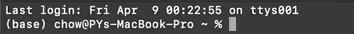
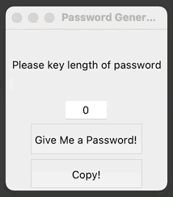

# PwdGen
PwdGen is a python script which generates a random password of desired length. This password can then be copied to the clipboard for use.

Generated password will contain minimum of 1 symbol, 1 number and 1 letter character.

# Contents
- PwdGen.py - Python script to generate randomised password
  
- PwdGen.exe - Executable file containing the python script PwdGen.py

# How to run?
## PwdGen.py
1. The following packages/libraries are required to run this script via terminal:

         tkinter        
         random
         string

2. 'cd' into directory where PwdGen.py is placed in
3. Run PwdGen.py on terminal :

    

4. Windowed GUI will be generated

## PwdGen.exe
1. Open PwdGen.exe

2. Windowed GUI will be generated

# Example

# Additional Info
This script was created in Python 3.7.10 as a fun little mini project.

Feel free to direct comments or feedback to me at chowpoiyee@gmail.com

Last updated: 8th April 2021